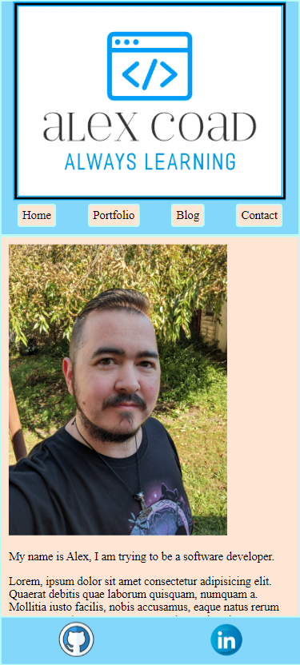

# Alex Coad's Portfolio

## __Purpose__
To showcase my coding capabilities.

## __Target Audience__
This portfolio is intended for potential employers looking for a software developer.

## __Funtionality and Features__
This site features some of my personal projects I have worked on in the past following YouTube tutorials.

My resume is available via the Portfolio page.

I can be contacted if necessary via the Contact form.

## __Site map__

## __Screenshots__
Here we can see a couple of screenshots of the website as viewed on mobile, tablet, and desktop devices.

   

## __Where to fine me__
I can be found on [Github](http://github.com/forkets) and [LinkedIn](http://www.linkedin.com/in/alex-coad-60a3b5251/)

## __Tech Stack__
 
 

## __Image Credits__
I have included credit where due for some images used. Where credit is not given, image is owned by me.

https://www.looka.com

https://www.istockphoto.com/signature/photo/hippie-woman-stroll-on-mountain-gm612619528-105555089

https://www.istockphoto.com/photo/programming-code-abstract-technology-background-of-software-deve-gm537331500-95204155

https://www.dreamstime.com/royalty-free-stock-image-crochet-hook-yarn-image12157936

https://www.istockphoto.com/vector/game-on-neon-game-controller-or-joystick-for-game-console-on-blue-background-gm1320799591-407229871?phrase=gaming